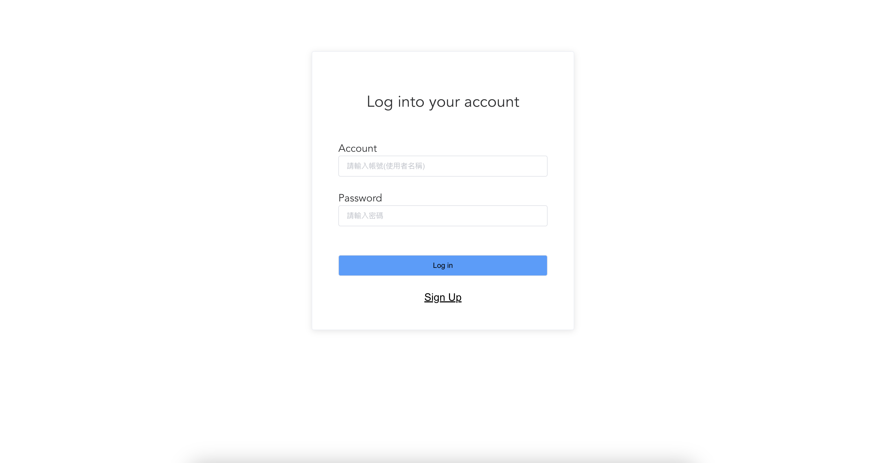
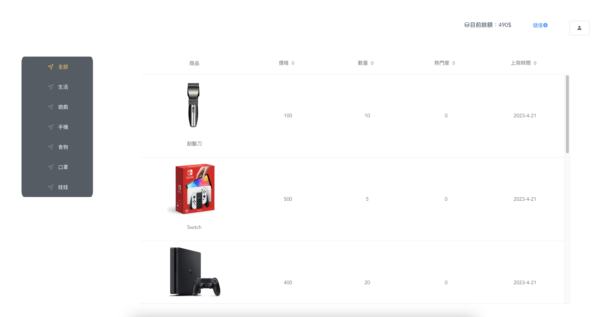
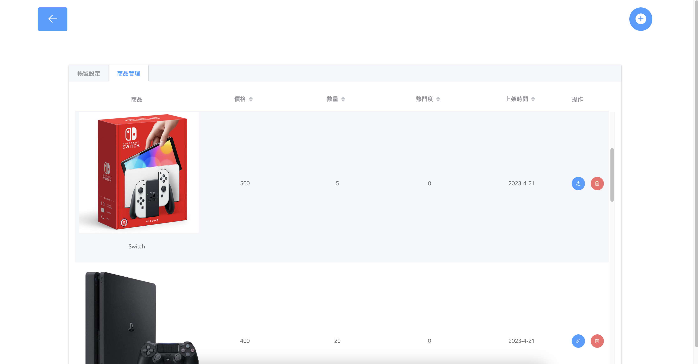

# claw-machine 線上夾娃娃機

## 網站架構

- 前端框架：vue2
- 後端: python
- 應用框架:Django
- 3D 模型：three.js
- 物理引擎：cannon.js
- 資料庫：db.sqlite3
- 網站伺服器：PythonAnywhere

## 使用

- 後端
  - 安裝 python 套件 ` ~ $ pip install -r requirements.txt`
  - 建立資料庫 `~ $ python manage.py migrate`
  - 開啟本地伺服器 `~ $ python manage.py runserver`
- 前端建構
  - 安裝 node_modules `~/front $ yarn`
  - 修改後建構 `~/front $ build`

## 畫面

- 登入/註冊
  
- 瀏覽頁面
  
- 遊戲頁面
  
- 後台管理
  

## 線上 demo

https://pseuder.pythonanywhere.com

## Troubleshooting

- ModuleNotFoundError: No module named ‘api.apps’  
   in python3.6

  ```
  # apps.py
  from django.apps import AppConfig

  def AppConfig(AppConfig):
      name = 'api'
  ```

  Solved:  
   in python 3.11

  ```
  # apps.py
  from django.apps import AppConfig
  def AppConfig(AppConfig):
      name = 'api'
  ```

- opensslErrorStack: [ 'error:03000086:digital envelope routines::initialization error' ],  
  library: 'digital envelope routines',  
  reason: 'unsupported',  
  code: 'ERR_OSSL_EVP_UNSUPPORTED'  
   Solved:  
   Downgrade node version to 16
  ```
  nvm use 16
  ```
